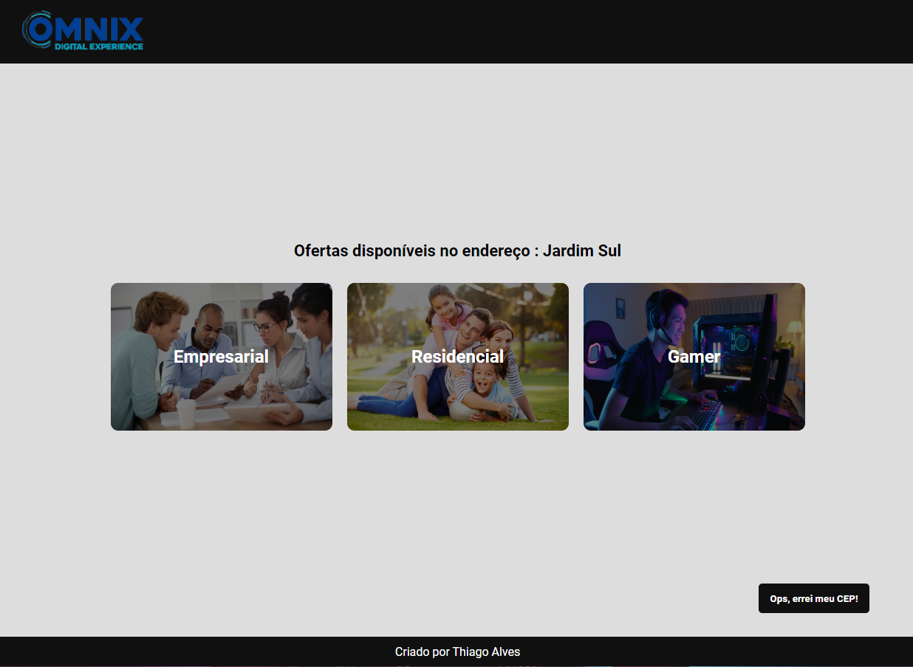
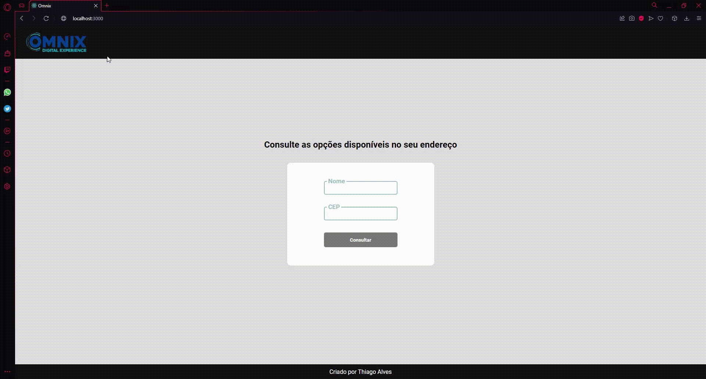

<h1 align="center">
    
</h1>

# Omnix Planos de Internet

O objetivo da aplicação é simular uma prestadora de serviços relacionados a internet. O usuário faz um cadastro digitando seu nome e CEP, caso o CEP seja válido o usuário pe redirecionado para uma página com os planos de internet disnponíveis.

<h1 align="center">
    
</h1>

# O que eu usei?:

<ul>
<li>React</li>
<li>React Router Dom</li>
<li>React Hooks</li>
<li>Context API</li>
<li>Styled Components</li>
<li>Mobile First</li>
<li>Consumo de API's REST</li>
</ul>


# Demo 📸

<div align="center" >
  
</div>

# Pré requisitos

Você deve ter essas ferramentas instaladas na sua máquina : Git, Node.js e Yarn ou Npm.

# Rodando o App

1.Clone o projeto

```bash
# Execute esse comando utilizando git bash
$ git clone https://github.com/Thialves02/omnix.git
```

2.Entre na pasta clonada e execute os seguintes comandos

```bash
# Instalar as dependências
$ yarn install
$ npm install
```

3.Rode a aplicação
```bash
#Abra o app no seu navegador
$ yarn start
$ npm start
```
